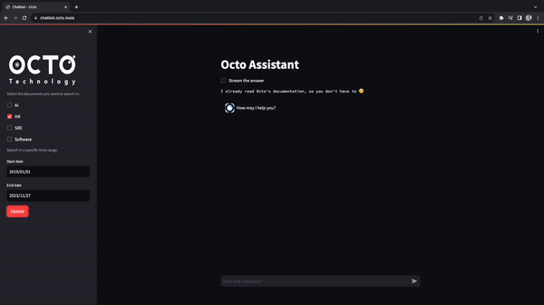
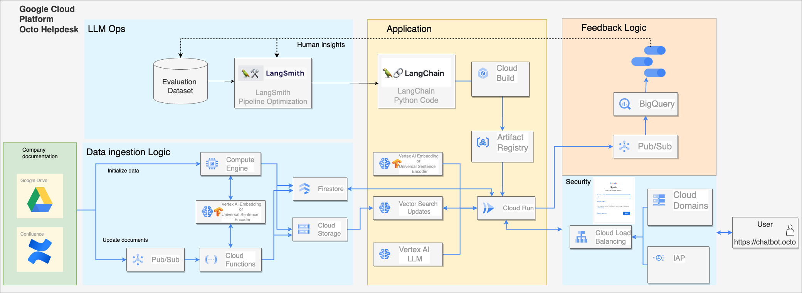

# Retrieval Augmented Generation with GCP Vertex AI Search

This repository contains the everything you need to deploy a smart and private question answering Chatbot from your Confluence data

Here is the demo of the app:

<p align="center">
  
</p>


It uses the following architecture:



# How to use

<!-- vscode-markdown-toc -->
* 1. [Prerequisites](#Prerequisites)
* 2. [Installation](#Installation)
	* 2.1. [Bootstrap of the project](#Bootstrapoftheproject)
		* 2.1.1. [Configure Terraform backend](#ConfigureTerraformbackend)
		* 2.1.2. [Bootstrap the project](#Bootstraptheproject)
	* 2.2. [Push the docker image to the Artefact Registry](#PushthedockerimagetotheArtefactRegistry)
		* 2.2.1. [Configure service account impersonation](#Configureserviceaccountimpersonation)
		* 2.2.2. [Add the secrets in GCP secret manager](#AddthesecretsinGCPsecretmanager)
	* 2.3. [Deploy GCP ressources](#DeployGCPressources)
		* 2.3.1. [Deploy GCP Ressources](#DeployGCPRessources)
	* 2.4. [Add data to your a Vertex Index](#AdddatatoyouraVertexIndex)
		* 2.4.1. [Add environment variables for a local data intialization](#Addenvironmentvariablesforalocaldataintialization)
		* 2.4.2. [Deploy the Vertex Index Endpoint](#DeploytheVertexIndexEndpoint)
* 3. [Local development](#Localdevelopment)
		* 3.1. [Prerequisites](#Prerequisites-1)
		* 3.2. [Install dependencies](#Installdependencies)
		* 3.3. [Run the app locally](#Runtheapplocally)
		* 3.4. [Understand the Chatbot logic with the notebooks](#UnderstandtheChatbotlogicwiththenotebooks)
		* 3.5. [Use docker and try the app on a container:](#Usedockerandtrytheapponacontainer:)
* 4. [Delete ressources](#Deleteressources)
		* 4.1. [Delete the Vertex AI ressources](#DeletetheVertexAIressources)
		* 4.2. [Delete the terraform ressources](#Deletetheterraformressources)
* 5. [Troubleshooting](#Troubleshooting)
* 6. [Roadmap](#Roadmap)
* 7. [References](#References)

<!-- vscode-markdown-toc-config
	numbering=true
	autoSave=true
	/vscode-markdown-toc-config -->
<!-- /vscode-markdown-toc -->

##  1. <a name='Prerequisites'></a>Prerequisites

- **Google Cloud CLI** : Install Google Cloud SDK following the instructions [here](https://cloud.google.com/sdk/docs/quickstart)
- **Terraform v>=1.5** : Follow the instructions [here](https://learn.hashicorp.com/tutorials/terraform/install-cli) to install the Terraform CLI locally
- a GCP project with enabled billing

##  2. <a name='Installation'></a>Installation

In the following commands, you will have to replace these variables with your own values:
- `my-project-id`
- `my-tfstate-bucket` : useful to share the tf.state file between multiple users
- `my-user-email` : the email you used to create your GCP account
- `my-region` : the region where you want to deploy the GCP ressources (ex: `europe-west1`)
- `my-service-account` : the name of the service account you want to create (ex: `project-sa`)
- `my-registry-name` : the name of the artificat registry that will be created (ex: `rag-api`)


###  2.1. <a name='Bootstrapoftheproject'></a>Bootstrap of the project

| **Prerequisite** : GCP Admin Account

This step consistes of creating Terraform Service Account with the required roles (we used to deploy GCP ressources) and enable GCP APIs.
If you are not owner of your project because you are using your company GCP account, you can ask your GCP admin to create a SA and give you the serviceAccountTokenCreator role.

####  2.1.1. <a name='ConfigureTerraformbackend'></a>Configure Terraform backend

To configure the Terraform backend first you need to:

- Create the GCS bucket to store the tf.state file
The bucket name must be unique because the namespace is shared across all GCP projects.

```bash
gcloud init # Use your email and project settings
gcloud auth application-default login # Authenticate on GCP with admin account
gcloud storage buckets create gs://<my-tfstate-bucket> --project=<my-project-id> --location=<my-region> # You need storage.buckets.create permission (ex: roles/editor)
```

Update GCS bucket name & prefix :

```bash
cd terraform/bootstrap
vim backend.tf
# Edit <my-tfstate-bucket> with the name of the bucket created above
vim terraform.tfvars
# Edit the values of project_id, location, artifactregistry_name and service_account_name
```

####  2.1.2. <a name='Bootstraptheproject'></a>Bootstrap the project

```bash
terraform init # You need storage.buckets.list permission (ex: roles/storage.objectUser)
terraform apply -var gcp_account_email="<my-user-email>"
```


###  2.2. <a name='PushthedockerimagetotheArtefactRegistry'></a>Push the docker image to the Artefact Registry

####  2.2.1. <a name='Configureserviceaccountimpersonation'></a>Configure service account impersonation

```bash
export GOOGLE_IMPERSONATE_SERVICE_ACCOUNT=<my-service-account>@<my-project-id>.iam.gserviceaccount.com
```


```bash
# Docker authentication
gcloud auth configure-docker <my-region>-docker.pkg.dev

# Build and push the image:
cd ../../ # Go back to the root directory
docker buildx build --platform linux/amd64 --push -t <my-region>-docker.pkg.dev/<my-project-id>/<my-registry-name>/gen-ai:latest .

vim terraform/terraform.tfvars
# Change the image name in the terraform/terraform.tfvars file with the one you created
```

####  2.2.2. <a name='AddthesecretsinGCPsecretmanager'></a>Add the secrets in GCP secret manager

To secure the Confluence identifiers, you need to add them in [GCP secret manager](https://console.cloud.google.com/security/secret-manager).
You need to store 4 secrets:
- `CONFLUENCE_PRIVATE_API_KEY`: the private API key of your Confluence account. [Create a key here](https://support.atlassian.com/atlassian-account/docs/manage-api-tokens-for-your-atlassian-account/)

- `CONFLUENCE_SPACE_NAMES`: the list of Confluence spaces names, useful for filters. You can find the space name in the URL of the space. For example, if the URL of your space is `https://my-company.atlassian.net/wiki/spaces/SPACE_NAME/overview`, the space name is `SPACE_NAME`.

- `CONFLUENCE_URL`
- `CONFLUENCE_EMAIL_ADRESS`

###  2.3. <a name='DeployGCPressources'></a>Deploy GCP ressources

####  2.3.1. <a name='DeployGCPRessources'></a>Deploy GCP Ressources

```bash
cd terraform
vim ./terraform.tfvars # Follow the instructions in the file to fill the variables
vim ./backend.tf # Update <my-tfstate-bucket> with the name of the bucket created above
terraform init
terraform apply # It will take approximatively 30 minutes to create the index
```

Now your Cloud Run service is deployed and you can access it with the URL displayed in the terraform output.

We have now to add data to the Vertex AI Search Index and deploy an endpoint to be able to query it.

Keep the two variables from the terraform output:
- `my-index-id` : the Vertex AI Search Index ID
- `my-index-endpoint-id` : the Vertex AI Search Index Endpoint ID
They will be used in the next step.

###  2.4. <a name='AdddatatoyouraVertexIndex'></a>Add data to your a Vertex Index

The vector index is empty.
We need to add data to it and deploy an endpoint to be able to query it.
It will:
- collect urls from the Confluence Space you mentionned in the Confluence space names variable
- load each valid space url text and create chunks
- generate embeddings and save it to GCS


####  2.4.1. <a name='Addenvironmentvariablesforalocaldataintialization'></a>Add environment variables for a local data intialization
The data initialization in GCP compute engine will be available soon

```bash
cd ../src
cp ~/.config/gcloud/application_default_credentials.json ./credentials.json
cp ../.env.template .env
vim .env # add the required variables
# Install poetry and dependencies before ?
poetry run python -m upload_data.data_init
# You may have to wait up to an hour for the index to be updated.
# You can check the GCP Vector Search console and check the number of vectors in the index to see when it is updated.
```

####  2.4.2. <a name='DeploytheVertexIndexEndpoint'></a>Deploy the Vertex Index Endpoint

Once the index is not empty and contains our data, we can deploy an endpoint to be able to query it.
```bash
gcloud ai index-endpoints deploy-index <my-index-endpoint-id> \
	--index=<my-index-id> \
	--deployed-index-id=ragdeployedindex \
	--display-name=ragendpoint \
	--region=<my-region>
```


You can go now go to the Cloud Run console and try the chatbot.


##  3. <a name='Localdevelopment'></a>Local development

####  3.1. <a name='Prerequisites-1'></a>Prerequisites
- [Poetry](https://python-poetry.org/)

To work on a local environement, you first need to follow the preivous step or at least deploy a vector index and a deployed endpoint.

####  3.2. <a name='Installdependencies'></a>Install dependencies

Create a virtual environment using poetry:
```bash
poetry install
```

You won't be able to use the secret manager in local, you have to copy the secrets in the `.env` file.
If not already done
```bash
cd src
cp ~/.config/gcloud/application_default_credentials.json ./credentials.json
cp ../.env.template .env
vim .env # add the required variables
```

####  3.3. <a name='Runtheapplocally'></a>Run the app locally
```bash
cd src
# To run the app in local:
poetry run python -m streamlit run chatbot/app.py

# At initialization, add new data:
poetry run python -m upload_data.data_init

# To update the index with new/modified/deleted Confluence data
poetry run python -m upload_data.data_update
```

####  3.4. <a name='UnderstandtheChatbotlogicwiththenotebooks'></a>Understand the Chatbot logic with the notebooks

```bash
make open-notebook
```


####  3.5. <a name='Usedockerandtrytheapponacontainer:'></a>Use docker and try the app on a container:

```bash
make demo
# Open http://localhost:8501/ in your browser
```

##  4. <a name='Deleteressources'></a>Delete ressources

####  4.1. <a name='DeletetheVertexAIressources'></a>Delete the Vertex AI ressources
```bash
gcloud ai index-endpoints undeploy-index <my-index-endpoint-id> \
    --project=<my-project-id> \
    --deployed-index-id=ragdeployedindex \
    --region=europe-west1 \
```

####  4.2. <a name='Deletetheterraformressources'></a>Delete the terraform ressources
```bash
terraform destroy
```

##  5. <a name='Troubleshooting'></a>Troubleshooting

> Cannot import Tensorflow

This can be caused in mac M1. Tensorflow requires to install tensorflow-metal with:
`poetry add tensorflow-metal`.

Be careful when using make build-docker after this command because tensorflow-metal cannot be installed in the docker image.

To remove this dependency if needed in local:
`poetry remove tensorflow-metal`

> ERROR: (gcloud.ai.index-endpoints.deploy-index) FAILED_PRECONDITION: Deploying empty Index is not allowed.

This error can be caused by an empty index. You need to add data to the index before deploying an endpoint.
If you have data in your storage, you have to update the index: `make update-index`.
If the index vector number is not 0 in the GCP console, try creating another index endpoint and deploy it with this new
endpoint.

##  6. <a name='Roadmap'></a>Roadmap

- [ ] Switch to Hexagonale Architecture
- [ ] Design a Cloud Build CI/CD
- [ ] Initialize data on GCP Compute Engine
- [ ] Add the Google Drive loader with LangChain or [our custom implementation](https://github.com/pprados/langchain-googledrive)
- [ ] Improve Retriever with [our custom implementation](https://github.com/pprados/langchain-rag)
- [ ] Integrate the evaluation process directly in GCP
- [ ] Export the dashboard from LangSmith to monitor RAG process in GCP

##  7. <a name='References'></a>References

[Article: Understand the RAG process with an example](https://blog.octo.com/le-chatbot-docto-langchain-rag-et-code-associe#:~:text=Le%20RAG%20est%20une%20technique,langages%20open%20ou%20closed%2Dsource)

[Code: GCP notebooks to understand the ingestion process and Vector Search usage](https://github.com/GoogleCloudPlatform/vertex-ai-samples/tree/main/notebooks/official/matching_engine)

[Doc: GCP Vector Search documentation on ingestion data format](https://cloud.google.com/vertex-ai/docs/vector-search/setup/format-structure)

[Doc: Understand the Vector Search filtering process](https://cloud.google.com/vertex-ai/docs/vector-search/filtering)

[Doc: Connect a PubSub subscription to BigQuery with a schema to bypass Dataflow](https://cloud.google.com/pubsub/docs/bigquery)

[Vidéo: How to implement IAP in your Cloud Run service](https://www.youtube.com/watch?v=ayTGOuCaxuc)